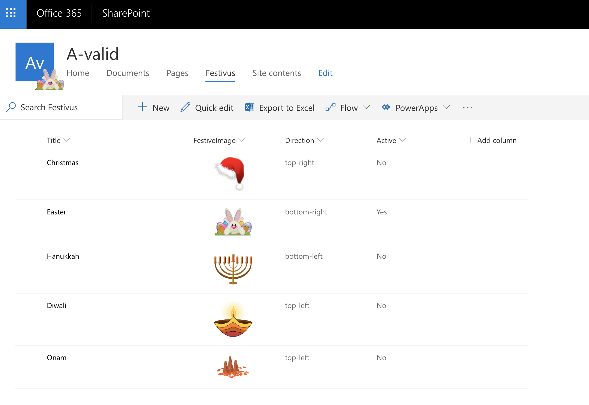

##  Festivus webpart

### Summary

This is a super fun `SPFx application customizer` just in time for Easter!

Inspired originally by this awesome content [Festivals](https://medium.com/@anoopt/spfx-application-customizer-festivals-953c0a15d12e) by [Anoop](https://medium.com/@anoopt)

You decorate your office/home for festivals, now let's decorate your Intranet logo!

Have a play around this application customizer to decorate your SharePoint site logo with what you choose and where you choose it to render!

## Used SharePoint Framework Version 


## Applies to

* [SharePoint Framework Extensions](https://dev.office.com/sharepoint/docs/spfx/extensions/overview-extensions)

## Solution

Solution|Author(s)
--------|---------
react-festivus-client-side-solution | Rabia Williams ([@williamsrabia](https://twitter.com/williamsrabia))

## Version history

Version|Date|Comments
-------|----|--------
1.0|March 14, 2019|Initial release

## Disclaimer
**THIS CODE IS PROVIDED *AS IS* WITHOUT WARRANTY OF ANY KIND, EITHER EXPRESS OR IMPLIED, INCLUDING ANY IMPLIED WARRANTIES OF FITNESS FOR A PARTICULAR PURPOSE, MERCHANTABILITY, OR NON-INFRINGEMENT.**

### How it works
This SPFX application customizer targets the logo element and places the IMAGE of your choice in the DIRECTION of your choice relative to the logo

The datasource is a SharePoint list `Festivus` with below columns:

* **FestiveImage** - Picture field
* **Direction** - Choice
  { `top-right`,`top-left`,`bottom-right`,`bottom-left`}
* **Active** - Yes/No 

 

### How it looks

Direction | Image
--------|--------
top-right|
top-left|
bottom-right|
bottom-left|


####Not really in the festive mood? just leave all list items in-active and it's all back to normal

### What's coming next 

Site scripts for `Festivus` list

### Building the code

```bash
git clone the repo
npm i
npm i -g gulp
gulp
```

This package produces the following:

* lib/* - intermediate-stage commonjs build artifacts
* dist/* - the bundled script, along with other resources
* deploy/* - all resources which should be uploaded to a CDN.

### Build options

gulp clean - TODO
gulp test - TODO
gulp serve - TODO
gulp bundle - TODO
gulp package-solution - TODO
